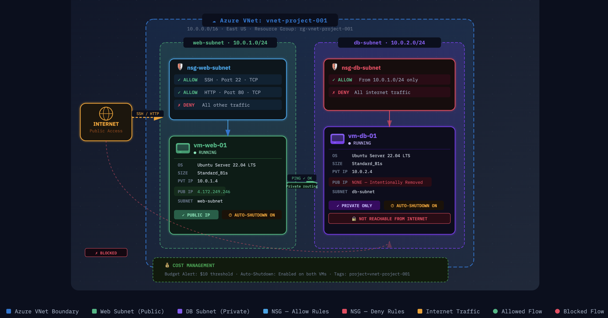

# ☁️ Azure Virtual Network Setup

## 📌 Project Overview
This project demonstrates the setup of a basic Azure Virtual Network (VNet) 
simulating a small-scale cloud infrastructure with separate tiers for 
web-facing and internal database resources.

## 🏗️ Architecture

### Network Design
| Component | Value |
|-----------|-------|
| VNet Name | vnet-project |
| Address Space | 10.0.0.0/16 |
| Web Subnet | 10.0.1.0/24 |
| DB Subnet | 10.0.2.0/24 |
| Region | Central Canada |

## 🔐 Network Security Groups

### NSG — Web Subnet
| Rule | Port | Protocol | Source | Action |
|------|------|----------|--------|--------|
| Allow-SSH | 22 | TCP | Any | Allow |
| Allow-HTTP | 80 | TCP | Any | Allow |

### NSG — DB Subnet
| Rule | Port | Protocol | Source | Action |
|------|------|----------|--------|--------|
| Allow-From-WebSubnet | Any | Any | 10.0.1.0/24 | Allow |

## 🖥️ Virtual Machines

| VM Name | Subnet | Public IP | Purpose |
|---------|--------|-----------|---------|
| vm-web | web-subnet | Yes | Web Server (public facing) |
| vm-db | db-subnet | No | Database Server (internal only) |

## ✅ Testing & Validation
- Successfully SSH'd into vm-web-01 via public IP
- Successfully pinged vm-db-01 from vm-web-01 via private IP
- Confirmed vm-db-01 is NOT reachable from the internet

## 📸 Screenshots
All configuration screenshots are available in the [screenshots](./screenshots/) folder.

## 🛠️ Tools Used
- Azure Portal
- Azure Virtual Network
- Network Security Groups (NSG)
- Azure Virtual Machines (Ubuntu 22.04 LTS)
- MacBook Terminal (SSH & ping testing)

## 📚 Key Learnings
- VNet segmentation separates public and private tiers for security
- NSGs act as firewalls at the subnet level controlling traffic flow
- Database servers should never have a public IP address
- Cost management starts with proper resource tagging and auto-shutdown
